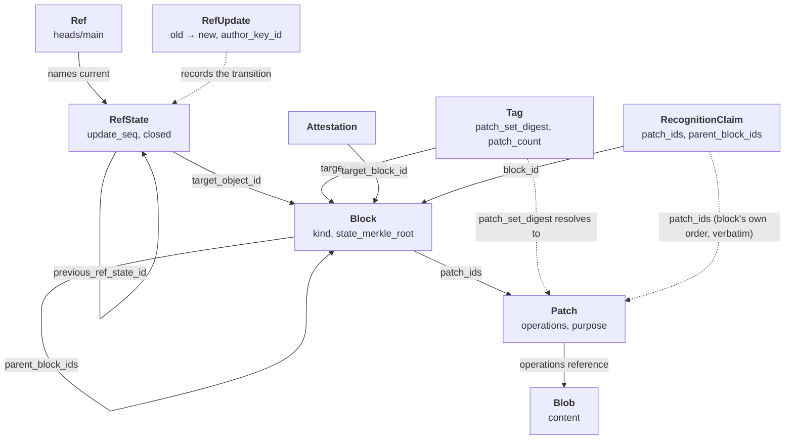
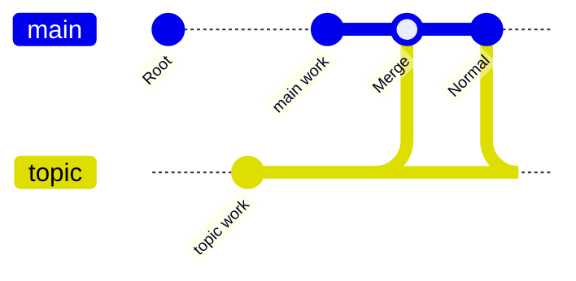
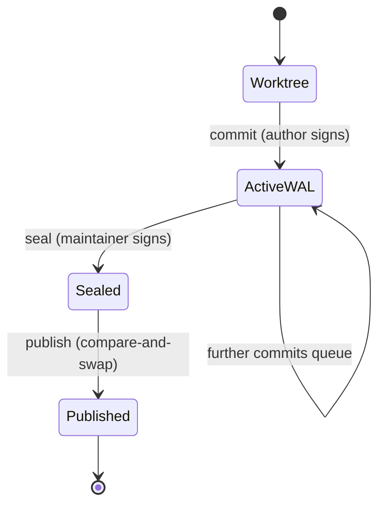
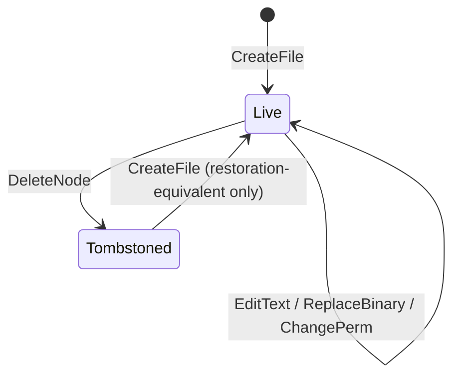
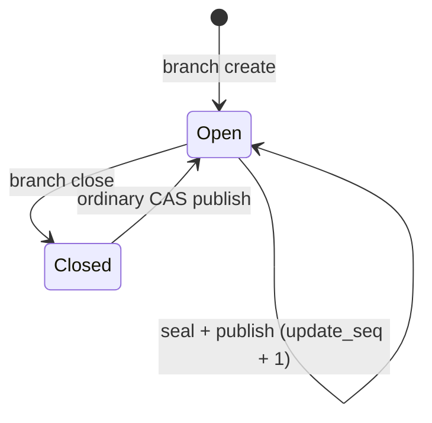

# Data Model Relationships and Lifecycle

How Prikk's objects relate to one another, and how each moves through its states.

This is the *relationship and lifecycle* view. For the per-object field contracts, identity rules, and
their source anchors, see [Data Model](./data-model.md). For the crate layering these objects live in,
see [System Architecture](./architecture.md).

## The object taxonomy

Ten object types. The type code is part of object identity, so an object of one type can never
collide with another type's id.

<!-- object-taxonomy-table:start -->
| Code | Type | Role | Stored in |
|---|---|---|---|
| `0x01` | **Patch** | An authored change: an ordered list of operations | `objects/` |
| `0x02` | **Block** | A sealed group of patches, linked into lineage | `objects/` |
| `0x03` | **RefState** | A ref's state at one point: which block it names | `objects/` |
| `0x04` | **RefUpdate** | The event advancing a ref from one state to the next | `refs/containers/` |
| `0x05` | **Tag** | A named, signed pointer into history | `objects/` |
| `0x06` | **Attestation** | A policy/plugin scan result about one block | `objects/` |
| `0x07` | **Blob** | File content, addressed by hash | `objects/` |
| `0x08` | **BlockSummaryCache** | Rebuildable derived summary — **never a root of trust** | `cache/` |
| `0x09` | **RecoveryNote** | A signed doctor-repair note; never a `RefUpdate` substitute | `refs/recovery/` |
| `0x0B` | **RecognitionClaim** | A signed claim: named patches were sealed into a named block, under the signer's key | `objects/` |
<!-- object-taxonomy-table:end -->

## How they relate

Three edges deserve comment:

- **`RefState → RefState`** is a backward chain via `previous_ref_state_id`, with a monotonic
  `update_seq`. Publication is compare-and-swap against the expected previous state.
- **`Patch → Patch` does not exist.** `parent_patch_ids` (`PatchPayload` tag 2) was removed outright
  at Patch schema 2 (`0.24.0`), not merely left unpopulated — **there is no patch DAG, by
  construction, not by omission.** Merge provenance is carried by block parentage instead. Schema 1
  patches (written before the retirement) may still carry the tag on disk, always empty;
  `accept_exchange_artifact` refuses it schema-blind — an incoming Patch carrying a non-empty
  `parent_patch_ids` at *any* schema is **refused outright** (`patch_exchange/accept.rs`), not
  merely ignored.
- **`Tag → Patch` is a digest, not a pointer, and resolving it is a search.** A tag's `target_block_id`
  is the local pointer half of its identity; `patch_set_digest` (RFC 117 T1) is the *portable* half —
  the digest of `target_block_id`'s own patch closure, the same value two repositories holding the same
  patches produce independently. A receiver with no local block matching `target_block_id` resolves the
  tag by **searching local blocks for one whose own patch closure produces the same digest**, pruned by
  the accompanying `patch_count` (T7) before any hashing — never by looking the digest up in an index.
  See [Recognition claims and sync relations](#recognition-claims-and-sync-relations) below.

## Block lineage

A block's `kind` determines its parent arity, and the shape validator enforces it.

| Kind | Parents | Extra required fields | Status |
|---|---|---|---|
| `Root` | 0 | — | In use |
| `Normal` | exactly 1 | — | In use |
| `Merge` | exactly 2 | `mainline_parent_id`, `merge_baseline_block_id` | In use since 0.19.0 |
| `Repair` | — | — | **Not authorized** — rejected outright |
| `Import` | — | — | **Not authorized** — rejected outright |

`parent_block_ids` is stored **sorted** by object id, which is why a merge cannot express "which parent
is mainline" positionally — `mainline_parent_id` names it explicitly instead. `merge_baseline_block_id`
records the baseline confluence was proven against, and `verify` re-derives that it is a genuine common
ancestor of both parents rather than trusting it.

## Patch and operations

A patch carries an ordered list of operations with contiguous `op_seq` from 1. Operations name **what**
they change by stable identity, never **where** by position — this is what lets a patch be adopted by a
merge without transformation, keeping its bytes and its author's signature intact.

| Operation | Identifies its target by | Authorable today |
|---|---|---|
| `CreateFile` | `node_id`, path | Yes |
| `DeleteNode` | `node_id` | Yes |
| `EditText` | `node_id` + `left_anchor_hash` / `right_anchor_hash` | Yes |
| `ReplaceBinary` | `node_id` | Yes |
| `ChangePerm` | `node_id` | Yes |
| `RenamePath` | `node_id` | **No** — no authoring path |
| `CreateSymlink` | `node_id` | **No** — symlink authoring is out of scope |

`EditText` also carries `presentation_hint_line`, which is explicitly **not part of algebraic identity**
— it is a display hint and never affects commutation.

A patch's `purpose` is either `Normal` or `RollbackDraft`; the latter survives WAL-to-object persistence
so a rollback draft stays classifiable.

## Recognition claims and sync relations

RFC 115/116/117 shipped a new object type, a namespace, and a resolution relation that don't fit
anywhere above. None of the three objects here are Blocks — they are how one repository tells another
what it holds, or records what it received.

**Claim → Block.** A `RecognitionClaim` is a signed assertion that specific patches were sealed into a
specific block, under the signer's key — nothing more. It is **never existence-checked against the
block or patches it names** at decode time: that is the entire reason it is a claim object and not a
Block, and it is what lets a claim be verified with none of its referenced objects present. Two fields
carry a *block's own* data verbatim, not independently chosen:

- **`patch_ids`** — the block's own `patch_ids`, in the block's own order (design-v1.md §11, D6).
  `Block.patch_ids` has no sorted-or-unique invariant; it is a free sequence consumed in order, and the
  claim mirrors it exactly. Order is load-bearing here — the receiver applies patches in this sequence —
  so sequence equality, not set equality, is what a consistency check against a held block must test.
- **`parent_block_ids`** — the block's own `parent_block_ids`, verbatim (RFC 116 design-v1.md §3, N3).
  This is what lets a batch of claims spanning a multi-block delta be sorted into sealing order without
  the receiver needing to have any of the blocks yet.

A claim that contradicts a block the receiver *does* hold is a detected lie, refused loudly by a
separate consistency check — the claim payload itself has no object-store access and cannot perform
that check.

**Tag → patch set digest → the patches that resolve it.** See the taxonomy diagram's comment above:
`patch_set_digest` is the identity that survives a tag moving between repositories, because two
repositories holding the same patches produce the same digest independently, while `target_block_id`
does not survive — blocks diverge by design even between repositories with identical history. A
receiver resolving a travelled tag has no direct pointer to follow; it **searches** its own local blocks
for one whose own patch closure hashes to the declared digest, using `patch_count` to prune candidates
by size before ever hashing one. This is a plausibility-tried relation, not a lookup — the search can
find `NotHeld` (not enough history synced yet) or `Ambiguous` (two local candidates match), and either
outcome refuses adoption rather than guessing.

**Received objects → `remotes/` → local refs, and import never advances a local ref.** Imported history
(via `bundle import` or `sync accept`) is recorded under a **received pointer**, always named
`remotes/<origin ref name>` — a distinct namespace from `refs/by-id/`'s ordinary pointers, because a
received `RefState`'s embedded `ref_name` still names the *origin's own* ref (rewriting it would
invalidate the object's content-addressed identity and signature). Turning received history into local
history is an ordinary `merge`, using machinery that already exists — receiving is never itself a "pull"
that advances anything. The received-pointer index is its own small append-only container, **never read
by `verify_repository`**: every object a received pointer leads to (RefState, Block, Patch, Blob,
Attestation) is an ordinary object-store entry, checked exactly like any other by the existing
type-based object scan, so there is no new verification path — only a new way to *discover* a receiver's
own object graph by name.

## Lifecycle: content, from worktree to sealed history

Sealed history is append-only. Nothing above removes or rewrites a sealed object; a rollback is a new
patch that inverts an earlier one, not an erasure.

## Lifecycle: a node

Nodes — files and their identities — have their own state machine, enforced by `prikk-replay`.

The last transition is the constrained one. Once a `node_id` has been seen, re-creating it requires
**restoration-equivalence** to that node's latest tombstone — you cannot silently reuse a node identity
for different content. Every `node_id` ever seen is retained for exactly this check, which is why
lifecycle state grows with cumulative history rather than with the current tree.

## Lifecycle: a ref

Closure is a published ref state carrying `closed`, not a deletion — history and every object stay.
Reopening is permitted and is an ordinary compare-and-swap update, though no `branch reopen` verb exists
today.

Note that neither `seal` nor `merge` inspects `closed`, so advancing a closed branch reopens it silently.
This is consistent with closure being advisory rather than a lock, but it is unreported by those
commands.

## Lifecycle: a repository

Before `init`, there is nothing: no `.prikk/` directory, no lifecycle to describe. `init` creates the
full layout in one pass and writes `FORMAT` **last** — every other required file or empty container is
created first, all through idempotent, retryable primitives. An interrupted `init` therefore leaves
`FORMAT` absent, which is itself the detectable, safe state: a re-run of `init` skips straight past the
already-initialized guard (which only fires once `FORMAT` exists) and completes whichever names are
still missing. This is tolerated only because an interrupted `init` has nothing to lose — no user
history exists yet.

Every other command opens an existing repository through `RepositoryLayout::open`, which reads `FORMAT`
and refuses outright if it names anything but a supported format: 7, which new repositories get, or 6,
which a repository created by 0.44.0 or earlier has (RFC 114 rules formats 1-5 out of scope). The one
format-migration verb is `prikk format upgrade`, which moves format 6 to 7 in place after verification;
any other marker is refused by every command, including `init` itself against an already-initialized
directory (its own, terser refusal).

There is no decommission or deletion lifecycle for a repository as a whole — closure exists only at the
branch-ref level (see [Lifecycle: a ref](#lifecycle-a-ref) above), with no repository-level equivalent.

`doctor` and `unlock` are not lifecycle stages; they operate on whatever state a repository is already
in, regardless of how it got there. `doctor`'s only supported repair is truncating an incomplete
trailing active-WAL record (`--repair-wal-tail`); `--repair-main-ref` is a recognized input that
performs no repair and is always refused — see the
[integrity and recovery diagnostics](./integrity-recovery.md) reference. `unlock` reports, and on
request clears, stale lock files. Neither `doctor` nor `unlock` advances a repository through a stage
the way `init`/`commit`/`seal`/`publish` do.

## Lifecycle: compaction

Everything above is append-only: nothing is ever removed from a container, only new records added and
superseded. Three containers accumulate dead records this way — the ref-pointer index, the received
(imported-ref) index, and the trust-key/policy container — and `prikk compact` is the only operation
that reclaims any of it.

**What it rewrites.** Each of the three targets is compacted independently
(`compact_ref_pointer_index`, `compact_received_index`, `compact_trust_policy`; `--all` runs all three).
Compaction reads a container's currently-live slot, corruption-checked in full, reduces it to the same
"keep only the last record per key" rule its own reader already applies at read time, writes that
reduction to the container's currently-*retired* slot, and only then durably switches the generation log
to name the new slot live. The old slot's bytes are never touched until the switch to the new one is
already durable.

**What it preserves.** The reduction persists exactly what a reader would compute anyway — `verify`'s
output is unchanged by construction, not merely by inspection, because compaction writes the same
per-key "last entry wins" result its own read path already resolves at query time. `--plan-only` computes
and reports the same before/after record counts without writing anything, so an operator can preview the
effect before committing to it. There is no confirmation prompt, unlike `unlock`: the container lock
already excludes concurrent writers, the corruption check already covers every record, and the reduction
already persists exactly what every reader independently resolves — there is no unresolved fact left for
a prompt to gate on.

**What guarantees hold across it.** Compaction refuses outright on *any* known-corrupt record, not only
the latest one — stricter than an ordinary read, because compaction is destructive to the retired slot in
a way a read never is: a naive compactor that silently dropped a corrupt record while abandoning the old
slot would turn corruption into permanent deletion, through the very mechanism built to survive it. The
container's lock is held for the whole operation (resolve, read, reduce, and — for a real run —
truncate/write/switch), excluding every other writer of that container for its duration: `publish`,
trust changes, and bundle/sync import cannot observe a torn state, because they cannot run at all while
compaction holds the lock.

**What it never touches.** The ref log (`refs/containers/`, DC-38/DC-69's audit trail) and the
`RecoveryNote` container are never compaction targets — there is no function for either. Compaction never
touches sealed objects (`objects/`) at all; only the three pointer/policy containers above ever
accumulate reclaimable dead records.

## What the model does not currently record

Stated here so it is not inferred from silence:

- **No patch DAG.** `parent_patch_ids` was removed outright at Patch schema 2 (`0.24.0`), not left
  inert — an incoming Patch carrying a non-empty one (legal only at schema 1) is still refused
  outright on import.
- **A ref's `required_attestation_ids` are cleared by every ordinary seal**, while branch closure
  preserves them.
- **`RenamePath` and `CreateSymlink`** decode and validate but cannot be authored.
- **Merge-base discovery is manual** — `--baseline-block` is always explicit.
- **`0x0A` was `ProjectGenesis`, removed by the repository-identity settlement.** The code is
  permanently retired and must never be reassigned — see [Trust Roots and
  Roles](./trust-threat-model.md#trust-roots-and-roles) for why repositories carry no identity to
  anchor.
- **`Attestation` is defined but never constructed.** No production code path builds one; the object
  type and directory exist, and nothing populates them.
- **A tag's deletion and movement do not travel.** `sync`/`bundle` move a tag's *creation* and its
  adoption; a tag deleted or repointed locally has no mechanism to propagate that change to a
  repository that already received it.
- **There is no ref deletion at all**, of any kind, anywhere in `prikk-store` — the only
  `remove_ref_pointer_entry`-shaped function is test-only support, never reachable from a command. A
  branch can be *closed* (above); nothing can be *removed*. This is also why a tag written by an older
  schema cannot be cleared to make room for a new one under a later schema — there is no supported way
  to remove the ref standing in the way.
